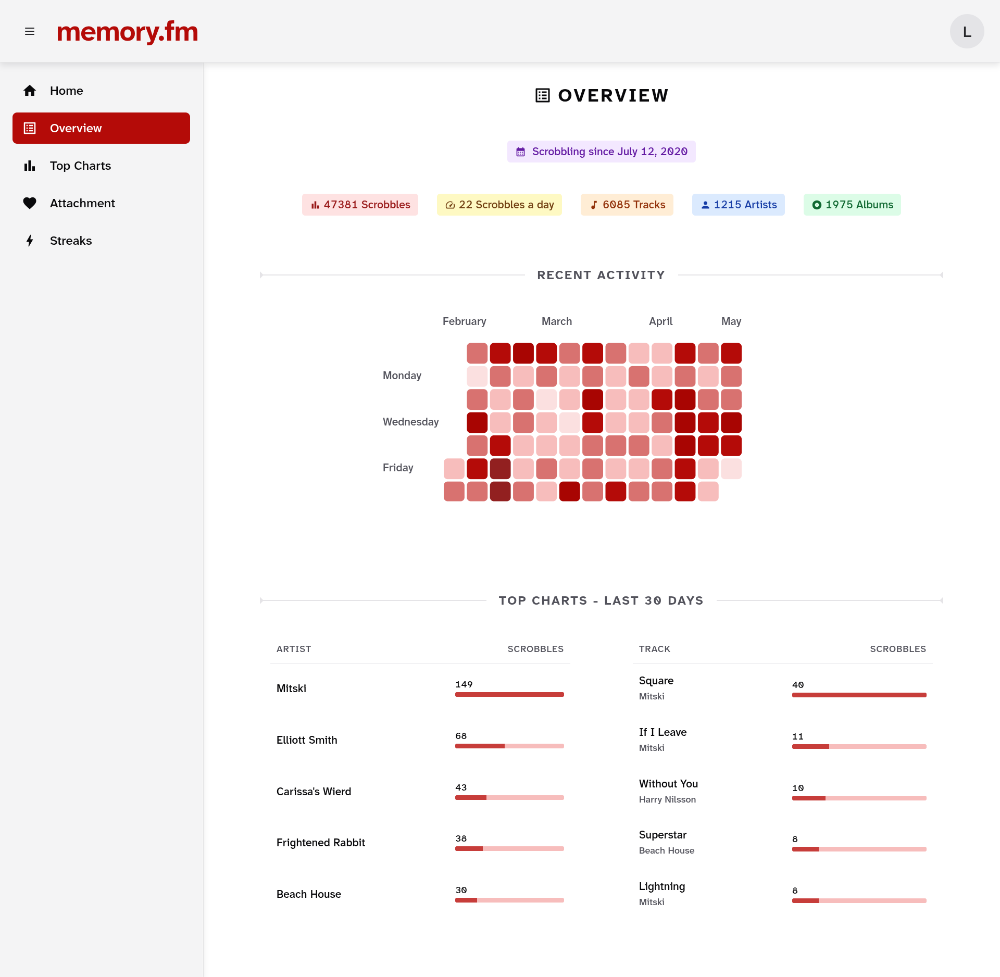
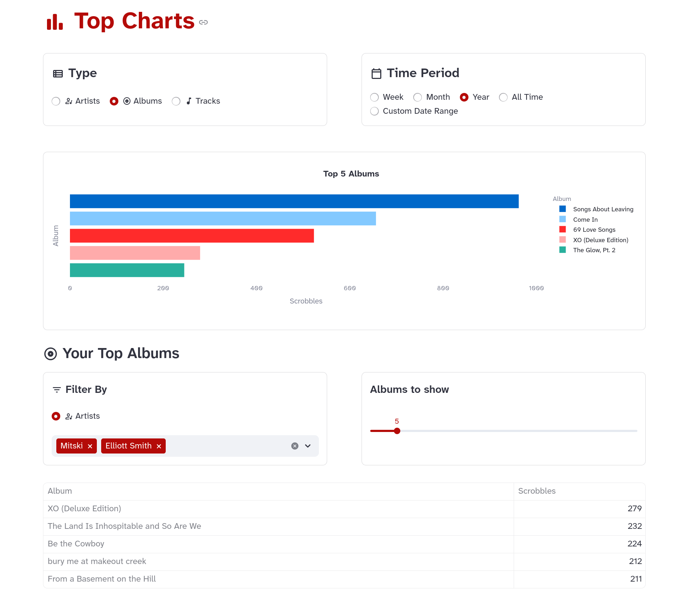
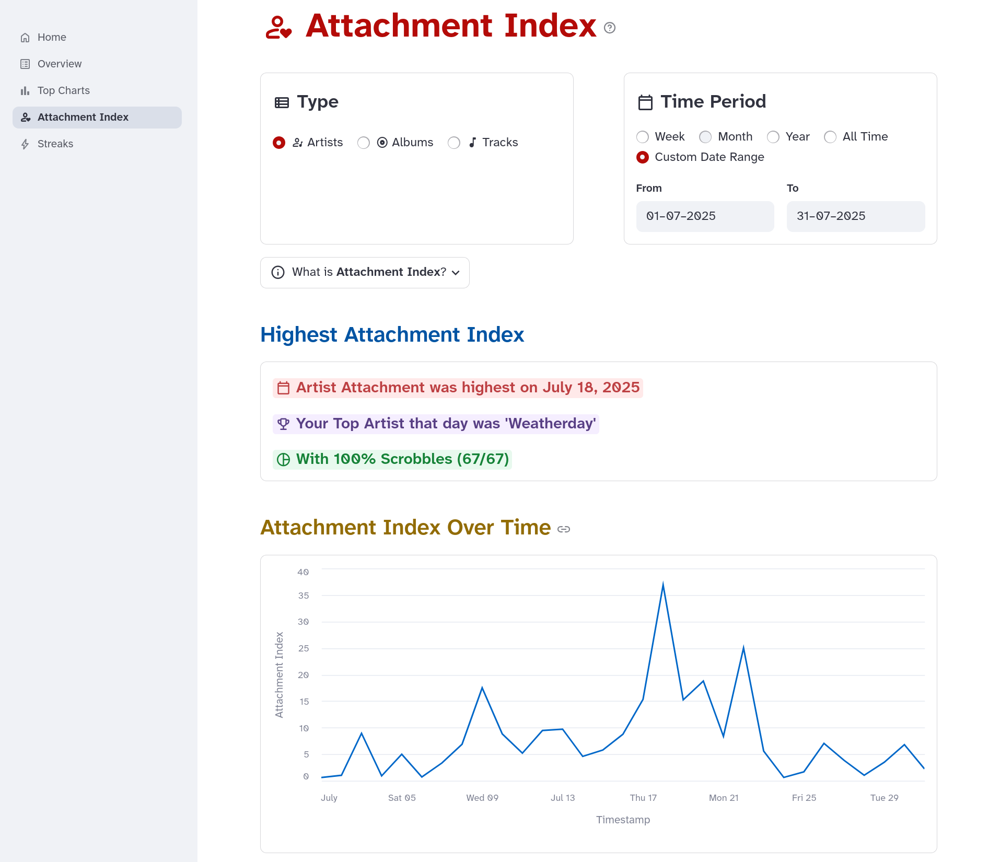
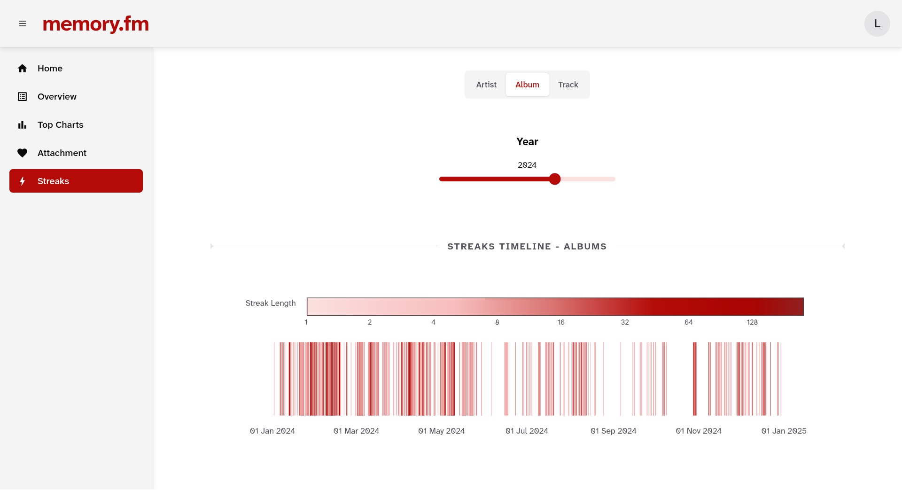

# memory.fm


[](LICENSE)
[](https://github.com/shsiddhant/memory.fm/actions/workflows/ci.yml)


**memory.fm** is a Python library, CLI tool, and web-based dashboard for exploring music listening history from Last.fm and Spotify.

Instead of focusing only on aggregate stats, it surfaces long-term and local patterns such as attachment, repetition, and obsessive listening, to help you revisit periods of your life through music.

>*✨Inspired by the idea of using music as a way to revisit memories.✨*

**[🔗 Check out the demo](https://memoryfm-demo.streamlit.app/)** to quickly test the stats and visuals dashboard.

## Features

### Import and Manage Your Listening History

- Import your complete listening history from **Last.fm** and **Spotify**.
- Fast incremental sync after the first import.
- Supports JSON/CSV exports from [lastfmstats](https://www.lastfmstats.com).

### Stats and Analytics

**memory.fm** focuses on *how* you listened, not just *what* you listened to.

#### Overview

Get a clean summary of your music listening history.

<p align="center">
  
</p>

#### Top Charts

- View your top artists, albums, and tracks.
- Filter them by weekly, monthly, and yearly periods, or a custom date range.

<p align="center">
  
</p>

#### Attachment Index

- See how concentrated your listening was during a given period using **Attachment Index**.
- Find out whether you were deeply attached to a few tracks, albums, or artists, or broadly exploring.

<p align="center">
  
</p>

#### Streaks

- Detect periods of intense, repeated listening to a single artist, album, or track. Streaks often correspond to emotionally significant moments or phases.

- With **Streaks Timeline**, you can view an interactive, color-coded timeline of your listening streaks. 

<p align="center">
  
</p>


### Interface

You have two UI options:
- **Graphical Dashboard:** A user-friendly graphical dashboard that runs inside your web browser.
- **CLI:** A command line tool with more granular control for power users.

## Installation

The package should soon be available on PyPI. For now, you can install it directly from the repository using pip:

```shell
pip install "memory.fm @ git+https://github.com/shsiddhant/memory.fm.git"
```

Requires **Python>=3.10**

## Quick Start

### Dashboard (Recommended for First-Time Users)

Launch the interactive web dashboard:
```bash
memoryfm-gui
```

This opens a browser interface at `http://localhost:8501` where you can:
- Import your listening history from Last.fm or Spotify
- Explore visualizations and analytics
- View your attachment patterns and listening streaks

### Command Line Interface

For power users, the CLI offers more granular control:
```bash
# Import data from Last.fm
memoryfm import last.fm <your_username>

# Import from Spotify export
memoryfm import spotify path/to/my_spotify_data.zip --username <use_any_username>

# Load your import
memoryfm load <your_username>

# View top artists for the last month
memoryfm top artists --last month

```

See the [CLI documentation](https://memoryfm.readthedocs.io/en/stable/quickstart/cli_usage.html) for all available commands.

### Python Library

Use memory.fm programmatically in your own projects:
```python
import memoryfm as mfm

# Load your listening history
sclog = mfm.from_lastfm_api(username="your_username",
                            tz="Asia/Kolkata")

# Filter by dates
filtered_sclog = sclog.filter_by_date("2025-09-12 10 PM", end="2025-09-13 10:40 AM")

# Calculate attachment index of order alpha
attachment = mfm.attachment(sclog, by="album", year=2024, alpha=2)
```

See the [API documentation](https://memoryfm.readthedocs.io/en/stable/references/index.html#api) for more examples.

## Documentation

Full documentation is available at: https://memoryfm.readthedocs.io


## Roadmap

- [x] Support for loading Spotify listening history exports
- [x] CLI commands for loading, printing, exporting, filters, top charts, etc.
- [x] API support for Last.fm
- [x] Attachment Index
- [x] Streaks and Streaks Timeline
- [ ] Time of Day / Season based analysis
- [ ] Memory Attachments and Timeline integration
- [ ] Spotify wrapped but make it nerdier
- [ ] Export options for data, visuals, and memory attachments
- [ ] Apple Music support

Check the [issue tracker](https://github.com/shsiddhant/memory.fm/issues) for more details.

## Contributing

Contributions are welcome - whether you’d like to fix a bug, suggest an improvement, or propose new ideas for **memory.fm**.

If you find a bug or have a feature request, please open an issue using the appropriate template in the [issue tracker](https://github.com/shsiddhant/memory.fm/issues).

For detailed guidelines on contributing and development setup, see [CONTRIBUTING.md](CONTRIBUTING.md).


## License
This project is licensed under the [MIT License](LICENSE).


## Acknowledgements

Thanks to Felix Hagemans ([felhag](https://github.com/felhag)) for creating [lastfmstats](https://www.lastfmstats.com), which inspired parts of this
project.
