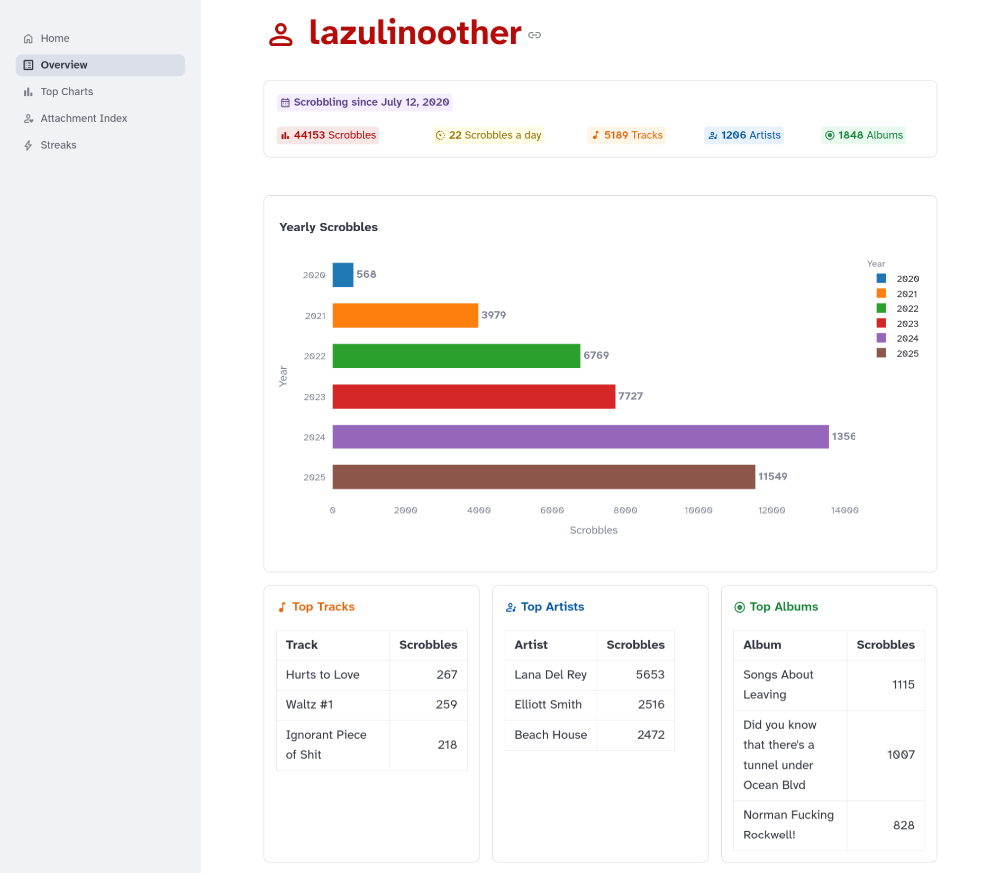
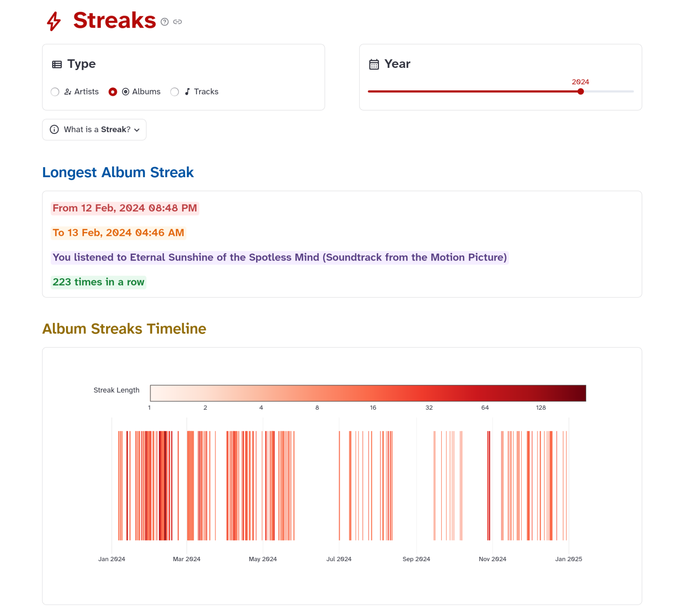

.. _quickstart.dashboard:

=========
Dashboard
=========

A user-friendly graphical dashboard that runs inside your web browser.

Launch the dashboard:

.. sourcecode:: shell

   $ memoryfm-gui

This will open the dashboard in a browser window or a tab (if the browser is already open) of your default browser. 
You can also opens it by visiting http://localhost:8501 in your favorite browser.

.. note:: 
   If you have a home network, once you launch the dashboard on your computer, 
   you can open it on any of your devices connected to the network by visiting:
   ``http://your_computer_ip:8501``.
   Replace ``your_computer_ip`` with your computer's ip address.

The dashboard provides four main views:

Overview
--------

Get a clean summary of your music listening history.

Top Charts
----------

View your top artists, albums, and tracks by time period.

.. image:: ../_static/screenshots/top_charts.png
   :width: 600px

Attachment Index
----------------

Visualize how concentrated your listening was during a given period.

.. image:: ../_static/screenshots/attachment_index.png
   :width: 600px

Streaks
-------

Find out periods of repetitive listening of an artist, album, or track, visualized in 
a color-coded timeline.

